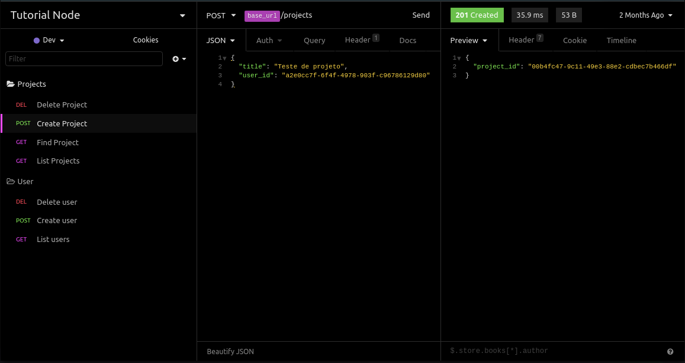

# API Rest com Node e Express

## Objetivo
Neste tutorial vamos abordar a criação de uma aplicação fullstack utilizando Node e VueJS. Nesta primeira parte do tutorail, vamos criar a base da nossa API.

Vamos utilizar Node, Express, Postgres e o query builder Knex.

## 1 Criando o backend da aplicação

### 1.1 Configurando o servidor
Neste tutorial vou estar utilizando o *yarn*, entretanto o mesmo pode ser feito com o *npm*, basta adaptar os comandos.

Vamos começar, criando um novo o projeto com o seguinte comando via terminal.

```sh
yarn init -y
```
Agora vamos criar a pasta "src" na raiz do projeto, em seguida criamos o arquivo "main.js" dentro da **src**.

Vamos instalar o [Express](https://expressjs.com/) um micro framework que vai nos ajudar a configurar um servidor de maneira rápida.
```sh
yarn add express
```

No arquivo *main.js*, escrevemos:
```js 
// src/main.js
const express = require('express');
const app = express();

app.listen(3333);
```
Com isto, já podemos ter um servidor rodando na porta 3333. Eu geralmente gosto de criar variaveis para a porta e o ip caso eu precise trocar, assim,

```js
// src/main.js
const express = require('express');
const app = express();

const port = 3333;
const ip = 'localhost';

app.listen(port, ip, () => {
  console.log(`Server is running on http://${ip}:${port}`);
  console.log('Kill sever with: ctrl + c');
});
```
Para rodar o servidor, no terminal rodamos:
```sh
node src/main.js 
```
Feito isto, o servidor deve estar rodando na sua maquina.

Agora vamos adicionar nossa primeira rota. Inicialmente, vamos escrever direto no *main.js*, mais para frente iremos abstrair para um outro arquivo.

```js
// src/main.js
const express = require('express');
const app = express();

const port = 3333;
const ip = 'localhost';

app.get('/', ( request, response ) =>  response.json('Hello Word'));

app.listen(port, ip, () => {
  console.log(`Server is running on http://${ip}:${port}`);
  console.log('Kill sever with: ctrl + c');
});
```
Utilizamos o `app.get()` para criar uma rota de comunicação da nossa API e retornamos uma resposta (reponse) em **json**.

Para testa-lá, vamos utilizar o [Insomnia](https://insomnia.rest/download/). Baixe o **"Insomina Core"**, este programa irá ajudar a testar todas as rotas do nosso backend.

Com o **Insomina** aberto, clique no sinal de mais "+" e escolha a opção **New Request**, ou utilize o atalho "ctrl + N".
Defina um nome, como "test" e escolha o método de requisição como **GET**. Haverá um espaço para informar a url a ser testada, lá coloque `http://localhost:3333/`. 

Com o Insomnia configurado e o servidor rodando, clike no botão de "Send". Se tudo der certo, devera aparecer ao lado o status "200 OK" e logo abaixo a mensagem,

```json
"Hello Word"
```
 Vamos agora adicionar um lib que irá fazer o hot reload sempre que houver uma modificação no nosso código.

No termial, 
```sh
yarn add nodemon -D
```
Agora, dentro no arquivo `package.json`, vamos adicionar um script para rodar o nodemon, 
```js
"scripts": {
    "start": "nodemon src/server.js",
  },
```
O arquivo final deve estar parecido com isto:
```json
{
  "name": "backend",
  "version": "1.0.0",
  "main": "index.js",
  "scripts": {
    "start": "nodemon src/main.js"
  },
  "license": "MIT",
  "dependencies": {
    "express": "^4.17.1"
  },
  "devDependencies": {
    "nodemon": "^2.0.4"
  }
}
```
### 1.2 Abstraindo a aplicação

Agora iremos começar a fazer algumas abstrações do nosso código, separando responsabilidades da aplicação.

Primeiro, vamos criar um arquivo específico para nossas rotas. 

Primeiramente, vamos criar uma pasta chamada "routes" e dentro desta pasta um arquivo "index.js". Podemos então apagar a rota do "Hello word" no arquivo **main.js**.

```js
// src/routes/index.js
const express = require('express');

const routes = express.Router();

routes.get('/', (request, response) => response.json('Hi'));
// outras rotas 
module.exports = routes;
```

Agora vamos fazer mais uma abstração e separar o nosso arquivo **main.js** em dois. 

Primeiro vamos criar o **app.js** que vair ficar com a parte do express do **main.js**.
```js
// src/app.js
const express = require('express');
const app = express();

module.exports = app;
```
O **main.js**, renomeamos para **server.js** e importamos o nosso **app.js** utilizando o `require`, ficando, 
```js
// src/server.js
const app = require('./app');

const port = 3333;
const ip = 'localhost';

app.listen(port, ip, () => {
  console.log(`Server is running on http://${ip}:${port}`);
  console.log('Kill sever with: ctrl + c');
});
```
Agora precisamos editar o `package.json` trocando no sript o "main.js" para o "server.js"
```json
 "scripts": {
    "start": "nodemon src/server.js"
  },
```
Cancele o servidor e rode um `yarn start` novamente para verificar se esta tudo certo com o servidor.

### 1.3 Preparando  a aplicação para receber requisições

Agora vamos adicionar o **CORS** para que nosso frontend possa acessar o nosso backend. No terminal do projeto,
```sh
yarn add cors
```
Vamos também importar as rotas para o nosso **app.js** e configurar o Node para entender requisições do tipo json.

```js
// src/app.js
const express = require('express');
const cors = require('cors');
const routes = require('./routes');

const app = express();

app.use(cors());
app.use(express.json());
app.use(routes);

module.exports = app;

```
Rode o servidor novamente e verifique se tudo esta funcionando corretamente.

Com isso, temos a base do nosso servidor configurada, agora podemos vincular a aplicação à um banco de dados.

### 1.4 Banco de dados

Vou estar utilizando o [Docker](https://www.docker.com/get-started) com Postgres. Caso não queira utilizar o Docker, pode adaptar a parte das conexões com o banco de dados de sua preferência.

Em sistemas base Linux é muitos simples fazer a instalação e criação do container docker.

Para sistemas base Ubuntu,
```bash
sudo apt update
sudo apt install docker.io
```
Para iniciar e habilitar o docker, rode
```bash
sudo systemctl start docker
sudo systemctl enable docker
```
Agora basta criar o container do postgres, com
```bash
sudo docker run --name tutorial_CP -e POSTGRES_PASSWORD=docker -p 5434:5432 -d postgres
```
Neste comando estou:
    1. Cirando o nome do bando de dados docker como "tutorial_CP".
    2. Definindo a senha "docker".
    3. Rodando o docker na porta 5434 e dentro da container o Postgres esta rodando na porta padrão 3432.

Com o banco de dados instaldo, vamos criar a conexão com o servidor.

Vamos adicionar duas libs, utilizando o comando,
```sh
yarn add pg knex
```
O Kenx é um query builder que nos permite criar query utilizando javascrip em vez de SQL e o "pg" é o drive que Postgres.

Agora vamos criar o arquivo base de configuração do *knex*, no terminal (será necessário ter instalado o NPM para rodar este comando).
```sh
npx knex init
```
Esse comando irá criar um arquivo de configuração dentro da pasta do projeto chamado **knexfile.js**, neste arquivo apenas nos interessa a parter de `development`.
```js
// knexfile.js
module.exports = {

  development: {
    client: 'pg',
    connection: {
      host: "localhost",
      port: 5434,
      database: "tutorial_cp",
      user: "postgres",
      password: "docker",
    },
    migrations: {
      directory: './src/database/migrations'
    },
    useNullAsDefault: true,
  },
  
};
```

Agora devemos acessar o nosso banco de dados e criar a tabela de nome "tutorial_cp" que vamos utilizar para gravar os dados. No meu caso estou usando o [Postbrid](https://www.electronjs.org/apps/postbird), mas pode ser usado qualquer outro tipo interface de banco, ou o terminal.

Agora na pasta "src", criamos uma nova pasta chamada **database** e dentro dela, uma outra pasta chamada **migrations**. Aqui vamos utilizar o knex para criar nossas tabelas, sem precisar fazer isto no braço. Além disso, o Knex nos ajudará a manter um controle de versão do nosso banco de dados.

Vamos criar nossa primeira migration para a tabela de usuários, rodamos o comando,
```sh
npx knex migrate:make create_table_users 
```
Será criado um arquivo na pasta migrations, com duas funções vazias. Vamos utilizar estas funções para criar nossa tabela e caso precise, "dropa-lá".

Para criar as tabelas, em vez de usar o Knex com javascript, vou usar o Knex com SQL raw.
```js
// scr/database/migrations/dataEmTimeStamp_create_table_users.js
exports.up = async knex => {
  await knex.raw(
    `CREATE TABLE users (
      CREATE EXTENSION IF NOT EXISTS "uuid-ossp",
      id UUID PRIMARY KEY DEFAULT uuid_generate_v4(),
      email VARCHAR NOT NULL,
      password VARCHAR(30) NOT NULL,
      created_at TIMESTAMPTZ NOT NULL DEFAULT NOW(),
      updated_at TIMESTAMPTZ NOT NULL DEFAULT NOW()
    )
  `);
};

exports.down = async knex => await knex.raw('DROP TABLE users');
```
Para então executar a migration, no terminal do projeto,
```sh
npx knex migrate:latest
```

Vamos criar agora a tabela de projetos,
```sh
npx knex migrate:make create_table_projects
```
A nossa migration ficara da seguinte forma,
```js
exports.up = async knex => {
  await knex.raw(
    `CREATE TABLE projects (
      project_id UUID DEFAULT uuid_generate_v4(),
      title VARCHAR NOT NULL,
      user_id UUID,
      created_at TIMESTAMPTZ NOT NULL DEFAULT NOW(),
      updated_at TIMESTAMPTZ NOT NULL DEFAULT NOW(),
      PRIMARY KEY(project_id),
      FOREIGN KEY(user_id) REFERENCES users(id) ON DELETE CASCADE    
    )
  `);
};

exports.down = async knex => await knex.raw('DROP TABLE projects');
```
Aqui fizemos o relacionamento entre a tabelas de usuários e de projetos.

Rodamos então novamente o `npx knex migrate:latest`, para executar a tebela de projetos.

Por fim, vamos criar o arquivo que vai fazer a comunicação entre o banco de dados e o Knex.
 Dentro da pasta **database** vamos criar um arquivo **index.js** que ira serviar a conexão do banco de dados para nossa aplicação.
```js
// src/database/index.js
const knexfile = require('../../knexfile');
const knex = require('knex')(knexfile.development);

module.exports = knex;
```

### 1.5Criando rotas e controllers

Agora com a conexão com o banco de dados já realizadas, vamos escrever nossas rotas de verdade.

Atualmente em **src/routes/index.js** temos apenas uma rota de teste.

```js
routes.get('/', (request, response) => response.json('Hi'));
```
Nossa rota recebe uma função que irá executar tarefas como listar, cadastrar, editar e excluir informações do nosso banco de dados.

Para não deixar estas funções escritas diretamente na nossa rota, vamos abstrai-las em arquivos separados, que vamos chamar de **controlles**.

Vamos começar criando a pasta **controller** dentro da pasta **src**. Então vamos criar o controller de usuários, vou chamalo de "UserController.js"

Inicialmente vou definir três operações para ele, listar todos os usuários, criar e deletar um usuário.
```js
// src/controllers/UserController.js
const knex = require('../database');

module.exports = {

  async index(request, response) {
    try {
      const results = await knex.raw(`SELECT * FROM users`);

      return response.json(results.rows);
    } catch (error) {
      next(error);
    } 
  },

  async create(request, response, next) {
    try {
    const { email, password } = request.body;

      const query = `INSERT INTO users (email, password) 
      VALUES ('${email}', '${password}') RETURNING id`;

      const results = await knex.raw(query);

      return response.status(201).json(results.rows[0]);
    } catch (error) {
        next(error);
    }

  },

  async delete(request, response) {
    try {
      const { id } = request.params;
      
      await knex.raw(`DELETE FROM users WHERE id='${id}'`);

      return response.send();

    } catch (error) {
      next(error);
    }
  },
}
```
Agora vamos importar o controller no nosso arquivo de rota, de modo que nossas rotas ficaram da seguinte forma,
```js
// src/routes/index.js
const express = require('express');

const routes = express.Router();

const userController = require('../controllers/UserController');

routes.get('/users', userController.index);
routes.post('/users', userController.create);
routes.delete('/users/:id', userController.delete);

module.exports = routes;
```

De forma parecida vamos fazer para o "projects", vamos criar o **ProjectController.js**. Fica como exercico criar as rotas para os projetos (será quase idêntico ao controller de usuário).

Obs: Adicione uma função assincrona, que recebe três parâmetros (request, response, next), pega o id do request e retorna uma responsta em json com o projeto filtrado pelo id.

Por fim nosso arquivo de rotas, está assim,
```js
// src/routes/index.js
const express = require('express');

const routes = express.Router();

const userController = require('../controllers/UserController');
const projectsController = require('../controllers/ProjectsControllers');

routes.get('/users', userController.index);
routes.post('/users', userController.create);
routes.delete('/users/:id', userController.delete);

routes.get('/projects', projectsController.index)
routes.get('/projects/:id', projectsController.find)
routes.post('/projects', projectsController.create)
routes.delete('/projects/:id', projectsController.delete);

module.exports = routes;
```

Agora devemos testar todas as rotas utilizando o Insomnia. Recomendo fazer uma separação utilizando as pastas que o programa permite criar.

<h1 align="center">

</h1>

O exportável das rotas do Insomnia se encontra [aqui](https://github.com/ArielKollross/ProgrammingArticles/blob/master/NodeVueTutorial/tutorial/Insomnia_2020-08-25.json).

Com isso terminamos a primeira parte do tutorial. Ainda esta faltando várias funções, como por exemplos as validações de dados. Mas já estamos bem equipados para dar inicio ao frontend e conforme precisamos, vamos voltar ao backend para adicionar novas "features".

[Parte 2: Frontend com Vue](https://github.com/ArielKollross/ProgrammingArticles/blob/master/NodeVueTutorial/tutorial/FrontendPart2.md)